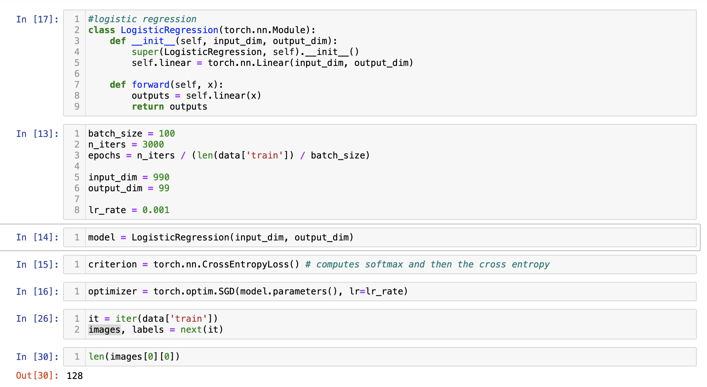
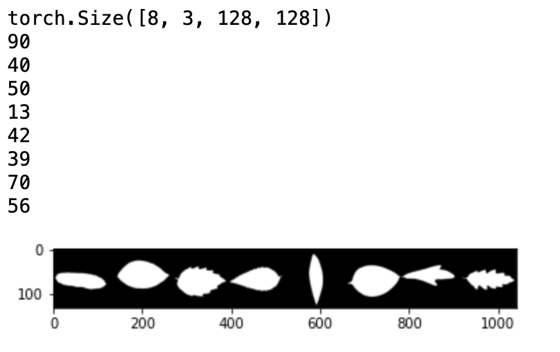

# CSE 455 final project - 
Inspired by the leaf detection completion on kaggle, I decided to use the same data to train my model that classifies a leaf image to its leaf type label. 

## Initial tries - 
In the beginning, I tried to implement Logistic regression with the dataset but I was facing some issues implementing it and understanding the DataLoader class of pytorch. So I had to drop that idea and instead work on a simple comvolutional network. 

## How to use the Repo - 
1. Download the zip file from [Kaggle](https://www.kaggle.com/c/leaf-classification/data).
2. Create a folder leaf-classification in the root directory of the project. 
3. Extract the downloaded zip file in this new folder created. 
4. Run notebook data-prep followed by training to see the model work. 

## Data preparation - 
Initially data is provided in the following form - 
1. Images - folder that contains all the jpg files of the leaves. In total has 1584 images in total. The whole dataset is divided into training dataset (contains 990 images) and the testing dataset.  
2. Train.csv - CSV file that contains information about all the images that need to be included in the training dataset. 
3. Test.csv - CSV file that contains information about all the images that need to be included in the testing dataset. 

Once the data is split in the testing and the splitting dataset, I start with the other notebook where the actual model training takes place. 

## Visualizations
 I also tried to show some visualizations using matplotlib. The visualization basically shows a set of 8 images that is read by the interator to the data loader.

## Model training and results
I define functions that help me feed the data to the ML model. The notebook then defines the convolutional neural network with two additional linear added on top of it to revice the output and adjust the wieghts. After training the model gives an accuracy of 45% on the testing dataset. 

## Key takeaway from the project - 
I was down with covid in the first half of the quarter so had a lot of catching up to do to complete the homeworks so could not do my best on this assignment. But while I was working on getting the simple model to run, I ran into a number of problems related to data loader and how it expects the image directory to be created. Apart from this, I also learnt the about various ML models and how they are different through graphs while I was working on my final project.  
